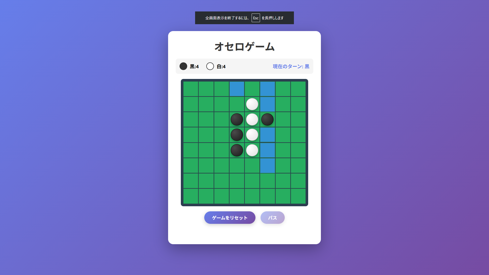

# オセロゲーム 🎮

クラシックなボードゲーム「オセロ（リバーシ）」をブラウザで楽しめるWebアプリケーションです。

## 🎯 デモ

[プレイはこちら](https://app001-osero.vercel.app/)

## ✨ 特徴

- 🎨 **美しいUI** - グラデーションを使用したモダンなデザイン
- 🎯 **直感的な操作** - 置ける場所が青色でハイライト表示
- 📊 **リアルタイムスコア** - 黒と白の石の数を常時表示
- 🔄 **アニメーション** - 石が反転する際の滑らかなアニメーション
- 📱 **レスポンシブ対応** - スマートフォンでも快適にプレイ可能
- 🎮 **パス機能** - 置ける場所がない時は自動的にパス

## 🎮 遊び方

1. 黒が先手でゲームが始まります
2. 青色にハイライトされたマスをクリックして石を置きます
3. 相手の石を挟むと、自分の色に反転します
4. 置ける場所がない場合は自動的にパスされます
5. 両者とも置ける場所がなくなるとゲーム終了
6. 石の数が多い方が勝利！

## 🛠️ 技術スタック

- **HTML5** - ゲームの構造
- **CSS3** - スタイリングとアニメーション
- **JavaScript** - ゲームロジック
- **Vercel** - ホスティング

## 🚀 ローカルでの実行

```bash
# リポジトリをクローン
git clone https://github.com/takamiya1021/app001-othello-game.git

# ディレクトリに移動
cd app001-othello-game

# ローカルサーバーを起動（Python3の場合）
python3 -m http.server 8000

# ブラウザでアクセス
# http://localhost:8000
```

## 📂 プロジェクト構造

```
app001-othello-game/
├── index.html      # メインのHTMLファイル
├── style.css       # スタイルシート
├── script.js       # ゲームロジック
├── screenshot.png  # スクリーンショット
└── README.md       # このファイル
```

## 🎨 主な機能

### ゲームボード
- 8×8のマス目
- 緑色の背景に黒と白の石
- 置ける場所を青色でハイライト

### スコア表示
- リアルタイムで黒と白の石の数を表示
- 現在のターンを表示

### コントロール
- **ゲームをリセット** - 新しいゲームを開始
- **パス** - 置ける場所がない時に使用（通常は自動）

## 🤝 貢献

プルリクエストを歓迎します！大きな変更の場合は、まずissueを開いて変更内容について議論してください。

## 📝 ライセンス

MIT License

## 👤 作者

takamiya1021

---

*楽しいオセロゲームをお楽しみください！* 🎯